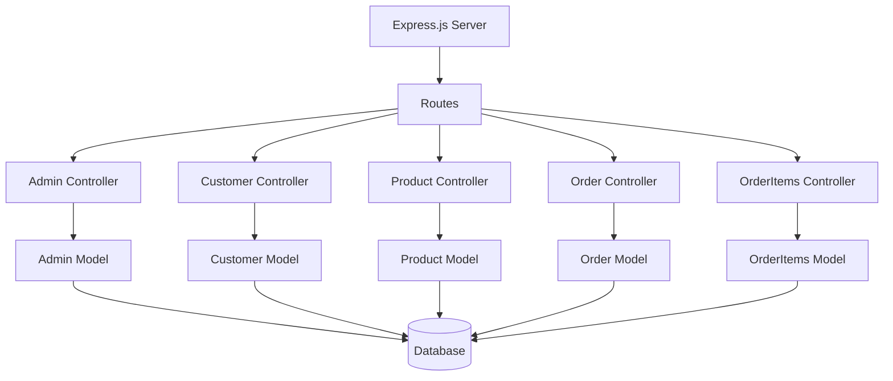

```mermaid
graph TD
    Server[Express.js Server]
    Router[Routes]
    AdminCtrl[Admin Controller]
    CustomerCtrl[Customer Controller]
    ProductCtrl[Product Controller]
    OrderCtrl[Order Controller]
    OrderItemsCtrl[OrderItems Controller]

    AdminModel[Admin Model]
    CustomerModel[Customer Model]
    ProductModel[Product Model]
    OrderModel[Order Model]
    OrderItemsModel[OrderItems Model]

    DB[(Database)]

    Server --> Router
    Router --> AdminCtrl
    Router --> CustomerCtrl
    Router --> ProductCtrl
    Router --> OrderCtrl
    Router --> OrderItemsCtrl

    AdminCtrl --> AdminModel
    CustomerCtrl --> CustomerModel
    ProductCtrl --> ProductModel
    OrderCtrl --> OrderModel
    OrderItemsCtrl --> OrderItemsModel

    AdminModel --> DB
    CustomerModel --> DB
    ProductModel --> DB
    OrderModel --> DB
    OrderItemsModel --> DB
```