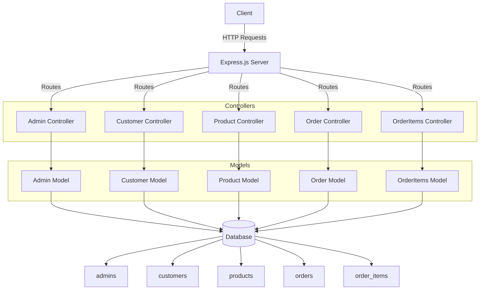

## Diagram

```mermaid
graph TD
    Client[Client]
    Server[Express.js Server]
    DB[(Database)]

    subgraph Controllers
        AdminCtrl[Admin Controller]
        CustomerCtrl[Customer Controller]
        ProductCtrl[Product Controller]
        OrderCtrl[Order Controller]
        OrderItemsCtrl[OrderItems Controller]
    end

    subgraph Models
        AdminModel[Admin Model]
        CustomerModel[Customer Model]
        ProductModel[Product Model]
        OrderModel[Order Model]
        OrderItemsModel[OrderItems Model]
    end

    %% Client to Server
    Client -->|HTTP Requests| Server

    %% Server to Controllers
    Server -->|Routes| AdminCtrl
    Server -->|Routes| CustomerCtrl
    Server -->|Routes| ProductCtrl
    Server -->|Routes| OrderCtrl
    Server -->|Routes| OrderItemsCtrl

    %% Controllers to Models
    AdminCtrl --> AdminModel
    CustomerCtrl --> CustomerModel
    ProductCtrl --> ProductModel
    OrderCtrl --> OrderModel
    OrderItemsCtrl --> OrderItemsModel

    %% Models to Database
    AdminModel --> DB
    CustomerModel --> DB
    ProductModel --> DB
    OrderModel --> DB
    OrderItemsModel --> DB

    %% Database to Tables
    DB --> admins
    DB --> customers
    DB --> products
    DB --> orders
    DB --> order_items


```
