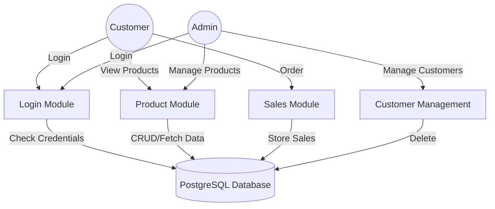

```mermaid
%%{init: {'themeVariables': { 'fontSize': '18px' }}}%%
flowchart TB
    Customer((Customer))
    Admin((Admin))
    Login[Login Module]
    Product[Product Module]
    Sales[Sales Module]
    CustomerMgmt[Customer Management]
    DB[(PostgreSQL Database)]

    %% Customer Flows
    Customer -->|Login| Login
    Customer -->|View Products| Product
    Customer -->|Order| Sales

    %% Admin Flows
    Admin -->|Login| Login
    Admin -->|Manage Products| Product
    Admin -->|Manage Customers| CustomerMgmt

    %% Common Module to DB
    Login -->|Check Credentials| DB
    Product -->|CRUD/Fetch Data| DB
    Sales -->|Store Sales| DB
    CustomerMgmt -->|Delete| DB
```